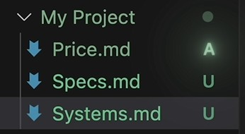

<h1 align="center">Git & GitHub Note</h1>

<p align="center"><strong>We use Windows for example</strong></p>

---

<h2 align="center">Git</h2>

<p align="center"><strong>What is Git ? How to use Git?</strong></p>


### DownLoad Git

- <https://git-scm.com/downloads>

──────────

- __Step 1__

    
    

    > 完成下載後，點擊exe檔案

- __Step 2__

    > 第一次安裝，不勾選 Only show new options  
    > 非第一次安裝，可勾選 Only show new options
    >> 
    >> 

    > 恭喜你完成 Git 安裝

─────────────────────────

### Commands of Git

- __git --version__

    | 取得版本編號

    ```bash
    git --version
    ```
    

- __git config --global__

    | 設定 UserName & UserMail

    ```bash
    git config --global user.name "XXXXX"
    git config --global user.email "XXXXX@gmail.com"
    ```

    
    

- __git init__

    | 創建後的資料夾必須透過初始化才會被 git 追蹤

    | 初始化後 git 會在目錄中創建一個隱藏的 .git 資料夾

    | 如果 .git 資料夾不甚被刪掉，所有歷史與備份紀錄都會消失

    ```bash
    git init
    ```

    

- __Git 檔案狀態__

    > 未追蹤(Untracked) : 檔案內容無論怎麼變更都只是檔案本身變更，Git 不會有任何紀錄  
    >> 檔案旁邊會顯示 **U**，表示檔案 Unstraked  
    >>> 

    > 已追蹤(Tracked) : 將檔案納入已追蹤後，Git 會開始記錄檔案的所有變更紀錄
    > 已暫存(Stage) : 檔案被追蹤時，就已經納入暫存區，準備提交
    >> 檔案旁邊會顯示 **A**，表示檔案 Stracked
    >>> 

    > 已提交(Commited) : 將檔案提交後，可以 push 至雲端
    >> 檔案旁邊的字母會消失
    >>> 

    > 當文件被變更後，需要重新將檔案納入暫存區
    >> 檔案旁邊會顯示 **M**，表示檔案已變更 但尚未提交
    >>> 


- __git status__

    | 查看目錄中的當前狀態

    ```bash
    git status
    ```
    
    

- __git add__

    | 將檔案納入暫存區

    ```bash
    git add XXXXX.md                單一檔案
    git add XXXXX.md XXXXX.md       多個檔案
    git add *.md                    目錄中的所有已變更的 md 檔案
    git add .                       目錄中所有已變更的檔案
    ```

- __git commit -m__

    | 將檔案提交

    ```bash
    git commit -m "說明文字"
    ```

- __git log__

    | 列出先前的提交歷史(提交者、提交日期、說明文字)

    | 會進入 Log 的檢視模式，欲要退出可以按下 q 退出檢視模式

    ```bash
    git log
    ```

    | 以下為簡化版

    ```bash
    git log --oneline
    ```

- __git diff__

    | 檢視檔案新舊版本的內容差異

    | 後面填入欲還原點的編號與檢視的檔案名稱

    ```bash
    git diff XXXXXXX -- XXXXX.md
    ```

- __git check__

    | 將檔案還原至某個時間點

    | 此方式保留先前的歷史紀錄 (較安全)

    | 此動作一樣需要 commit

    ```bash
    git checkout XXXXXXX -- XXXXX.md
    ```

- __git reset__

    | 將檔案還原至某個時間點
    
    | 此方式會移除往後的歷史紀錄 (較危險)

    ```bash
    git reset --hard XXXXXXX
    ```

- __git push__

    | 將本地端資料推送至雲端

    | 讓兩端儲存庫維持同步狀態

    ```bash
    git push
    ```

---

<h2 align="center">GitHub</h2>

<p align="center"><strong>What is GitHub ? How to use GitHub?</strong></p>

### Operate of GitHub

- __Create Repository__

    > 建立一個儲存庫
    > 填寫內容 (儲存庫名稱、說明文字、公開/私人)
    >> 

- __Connect Repository__

    

    | 連結本地與雲端的儲存庫

    ```bash
    git remote add origin https://github.com/XXXXX/XXXXX.git
    ```

    | 將主線分支名稱從 master 改為 main
    
    ```bash
    git branch -M main
    ```

    | 將本地端資料推送至雲端

    ```bash
    git push -u orign main
    ```